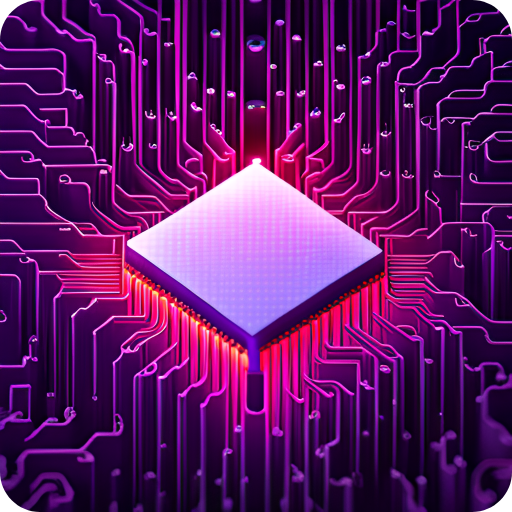
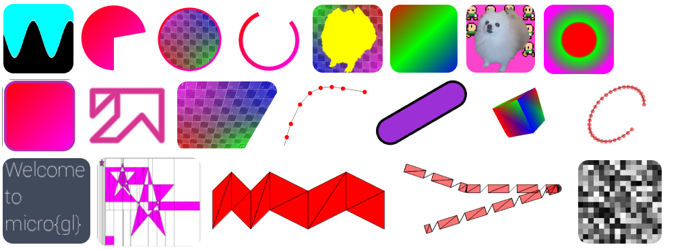

<div align='center'>

</div>

# micro{gl}
**Fast**, Super **Slim**, **Embeddable**, **Headers** only **`C++11`** vector graphics library, that  
can run on any 32/64 bits computer without **FPU** or **GPU**. **No standard library required**.


check out our website at [micro-gl.github.io/docs/microgl](https://micro-gl.github.io/docs/microgl)

<div align='center'>

</div>

## Features


> **Language** &nbsp;&nbsp;&nbsp;&nbsp;&nbsp;&nbsp;
- **`C++11`**, does not use any **`STL`** library and **standard library**.
- **headers only** library
- most functions are templates, which means you compile only what is used
- compile-time polymorphism (no runtime virtual methods)
- support for 32 bits and 64 bits
- self contained and modular.

> **Graphics** &nbsp;&nbsp;&nbsp;&nbsp;&nbsp;&nbsp;
- very modular design. if something does not exist, you can implement your own
- over 10 blending modes impemented, you can wrote your own and supply as well
- **`porter-duff`** alpha compositing
- support for 2d sampler
- can support any pixel coding you need, we implemeted a lot out of the box
- can render 3d geometries
- we support 3d shaders
- no need for **GPU**, it is all **CPU**
- no need for **FPU**
- support for any number system including **`Q`** numbers (fixed point), no need to use float points

> **Geometry** &nbsp;&nbsp;&nbsp;&nbsp;&nbsp;&nbsp;
- fast implementation for common shapes (rect, rounded rectangles, circles, triangles)
- batch traingles like **GPU** would
- support polygons of any type convex, simple, and complex polygons 
- path fills(with even-odd or zero-one fill rule) in any precision
- stroke fills
- quadrilaterals
- bezier patches
- we providea dynamic array, but you can plug your own.

## Installing `micro{gl}`
`microgl` is a headers only library, which gives the following install possibilities:
1. Using `cmake` to invoke the `install` target, that will copy everything in your system via
```bash
$ mkdir cmake-build-release
$ cd cmake-build-release
$ cmake -DCMAKE_BUILD_TYPE=Release ..
$ cmake --install .
```
2. Copying the `include/microgl` to anywhere you want.

## Consuming `micro{gl}`
Following options are available:
1. copy the project to a sub folder of your project. inside your **`CMakeLists.txt`** add
```cmake
add_subdirectory(/path/to/microgl)
target_link_libraries(your_app microgl)
```
2. If you installed **`micro{gl}`** with option 1 (see above) at your system, you can instead
```cmake
find_package(microgl CONFIG REQUIRED)
target_link_libraries(your_app microgl::microgl)
```
3. If you have not installed, you can add in your app's `CMakeLists.txt`
```cmake
target_include_directories(app path/to/microgl/folder/include/)
```
4. If you manually copied the `include/microgl` to the default system include path,  
you can use `cmake/Findmicrogl.cmake` to automatically create the cmake targets
```cmake
list(APPEND CMAKE_MODULE_PATH ${PROJECT_SOURCE_DIR}/path/to/Findmicrogl/folder)
find_package(microgl REQUIRED)
target_link_libraries(your_app microgl::microgl)
```
5. Just copy the `include/microgl` into a sub folder of your project and include the header  
files you need with relative path in your source files.

## Running Examples
First make sure you have 
 - [SDL2](https://www.libsdl.org/) installed at your system.  
 - [cmake](https://cmake.org/download/) installed at your system.

There are two ways:
1. Use your favourite IDE to load the root `CMakeLists.txt` file, and then it   
   will pick up all of the targets, including the examples
2. Using the command line:
```bash
$ mkdir cmake-build-release
$ cd cmake-build-release
$ cmake -DCMAKE_BUILD_TYPE=Release ..
$ cmake --build . --target <example_name>
$ ../examples/bin/example_name
```

```text
Author: Tomer Shalev, tomer.shalev@gmail.com, all rights reserved (2021)
```
