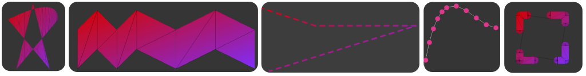

<div align='center'>

</div>

# micro{gl}
[](https://github.com/micro-gl/micro-gl/actions/workflows/compile_macos.yml)
[](https://github.com/micro-gl/micro-gl/actions/workflows/compile_ubuntu.yml)
[](https://github.com/micro-gl/micro-gl/actions/workflows/compile_windows.yml)

**Fast**, Super **Slim**, **Embeddable**, **Headers** only **`C++11`** vector graphics library, that can run on any 32/64 bits computer without **FPU** or **GPU**. **No standard library required**.


check out our website at [micro-gl.github.io/docs/microgl](https://micro-gl.github.io/docs/microgl)

<div align='center'>

</div>
<div align='center'>

</div>

## Examples

A circle with Texture fill and Gradient stroke
```cpp
using number = float;

using Canvas24= canvas<bitmap<coder::RGB888_PACKED_32>, CANVAS_OPT_32_BIT>;
using Texture24= sampling::texture<bitmap<coder::RGB888_ARRAY>, sampling::texture_filter::NearestNeighboor>;

fast_radial_gradient<number> gradient{0.5, 0.5, 0.75};
linear_gradient_2_colors<120> gradient2Colors{{255,0,255},
                                              {255,0,0}};
flat_color<> flatColor{{133,133,133, 255}};

auto img_2 = Resources::loadImageFromCompressedPath("images/uv_256.png");

Canvas24 canvas(W, H);;
Texture24 tex_uv{new bitmap<coder::RGB888_ARRAY>(img_2.data, img_2.width, img_2.height)};

gradient.addStop(0.0f, {255,0,0});
gradient.addStop(0.45f, {255,0,0});
gradient.addStop(0.50f, {0,255,0});
gradient.addStop(1.f, {255,0,255});

canvas.clear({255,255,255,255});
canvas.drawCircle<blendmode::Normal, porterduff::FastSourceOverOnOpaque, true, number>(
   tex_uv, // fill
   gradient2Colors, // stroke
   200+0, 200+0,
   150+t, 10, 255
);

```

A Rectangle, that samples a circle
```cpp
using Canvas24= canvas<bitmap<coder::RGB888_PACKED_32>>;
using number = float;
// using number = Q<12>;

circle_sampler<number> sampler{};

sampler.updatePoints({0.50,0.5}, 0.5, 0.10);
sampler.color_fill= {0, 0, 0, 255};
sampler.color_background= {255, 255, 255, 0};
sampler.color_stroke= {255, 255, 255, 255};

Canvas24 canvas(512, 512);

canvas.clear({255,0,255,255});
canvas.drawRect<blendmode::Normal, porterduff::FastSourceOverOnOpaque, false, number>(
        sampler,
        0, 0, 300, 300);
```

A path tessellation with red color
```cpp
template <typename number>
path_t<number> path_arc_animation() {
  path_t<number> path{};

  int div=32; //4

  path.arc({200,200}, 100,
           math::deg_to_rad(0.0f),
           math::deg_to_rad(360.0f),
           false, div).closePath();

  path.arc({250,200}, 50,
           math::deg_to_rad(0.0f),
           math::deg_to_rad(360.0f),
           true, div).closePath();

  path.moveTo({150,150});
  path.arc({150+0,150}, 50+t-0,
           math::deg_to_rad(0.0f),
           math::deg_to_rad(360.0f),
           false, div);//.closePath();

  return path;
}

// Choose your own number format
// using number = float;
// using number = double;
// using number = Q<15, long long>;
using number = Q<8, microgl::ints::int32_t, microgl::ints::int64_t, 1>;
// using number = Q<2, microgl::ints::int64_t>;
// using number = Q<4, microgl::ints::int32_t>;
// using number = Q<12>;

using Canvas24= canvas<bitmap<RGB888_PACKED_32>>;

sampling::flat_color<> color_red {{ 255, 0, 255, 255}};

Canvas24 canvas(255, 255);

canvas.clear({255, 255, 255, 255});
canvas.drawPathFill<blendmode::Normal, porterduff::FastSourceOverOnOpaque, false, true>(
   color_red,
   matrix_3x3<number>::identity(),
   path,
   microtess::fill_rule::even_odd,
   microtess::tess_quality::prettier_with_extra_vertices,
   255
);

```
## Features


> **Language** &nbsp;&nbsp;&nbsp;&nbsp;&nbsp;&nbsp;
- **`C++11`**, does not use any **`STL`** library and **standard library**.
- **headers only** library
- most functions are templates, which means you compile only what is used
- compile-time polymorphism (no runtime virtual methods)
- support for 32 bits and 64 bits
- self contained and modular.

> **Graphics** &nbsp;&nbsp;&nbsp;&nbsp;&nbsp;&nbsp;
- very modular design. if something does not exist, you can implement your own
- over 10 blending modes impemented, you can wrote your own and supply as well
- **`porter-duff`** alpha compositing
- support for 2d sampler
- can support any pixel coding you need, we implemeted a lot out of the box
- can render 3d geometries
- we support 3d shaders
- no need for **GPU**, it is all **CPU**
- no need for **FPU**
- support for any number system including **`Q`** numbers (fixed point), no need to use float points

> **Geometry** &nbsp;&nbsp;&nbsp;&nbsp;&nbsp;&nbsp;
- fast implementation for common shapes (rect, rounded rectangles, circles, triangles)
- batch triangles like **GPU** would
- support polygons of any type convex, simple, and complex polygons 
- path fills (with even-odd or zero-one fill rule) in any precision
- stroke fills
- quadrilaterals
- bezier patches
- we providea dynamic array, but you can plug your own.

## Installing `micro{gl}`
`microgl` is a headers only library, which gives the following install possibilities:
1. Using `cmake` to invoke the `install` target, that will copy everything in your system via
```bash
$ mkdir cmake-build-release
$ cd cmake-build-release
$ cmake -DCMAKE_BUILD_TYPE=Release ..
$ cmake --install .
```
2. Copying the `include/microgl` to anywhere you want.

## Consuming `micro{gl}`
Following options are available:
1. copy the project to a sub folder of your project. Inside your **`CMakeLists.txt`** add
```cmake
add_subdirectory(/path/to/microgl)
target_link_libraries(your_app microgl)
```
2. If you installed **`micro{gl}`** with option 1 (see above) at your system, you can instead
```cmake
find_package(microgl CONFIG REQUIRED)
target_link_libraries(your_app microgl::microgl)
```
3. If you have not installed, you can add in your app's `CMakeLists.txt`
```cmake
target_include_directories(app path/to/microgl/folder/include/)
```
4. If you manually copied the `include/microgl` to the default system include path,  
you can use `cmake/Findmicrogl.cmake` to automatically create the cmake targets
```cmake
list(APPEND CMAKE_MODULE_PATH ${PROJECT_SOURCE_DIR}/path/to/Findmicrogl/folder)
find_package(microgl REQUIRED)
target_link_libraries(your_app microgl::microgl)
```
5. Just copy the `include/microgl` into a sub folder of your project and include the header  
files you need with relative path in your source files.

## Running Examples
First make sure you have 
 - [SDL2](https://www.libsdl.org/) installed at your system.  
 - [cmake](https://cmake.org/download/) installed at your system.

There are two ways:
1. Use your favourite IDE to load the root `CMakeLists.txt` file, and then it   
   will pick up all of the targets, including the examples
2. Using the command line:
```bash
$ mkdir cmake-build-release
$ cd cmake-build-release
$ cmake -DCMAKE_BUILD_TYPE=Release ..
$ cmake --build . --target <example_name>
$ ../examples/bin/example_name
```

```text
Author: Tomer Shalev, tomer.shalev@gmail.com, all rights reserved (2021)
```

> 🙏🏻 Thanks to [JetBrains cLion Support Team](https://jb.gg/OpenSourceSupport) for granting this project an **OSS** license of **cLion** 
